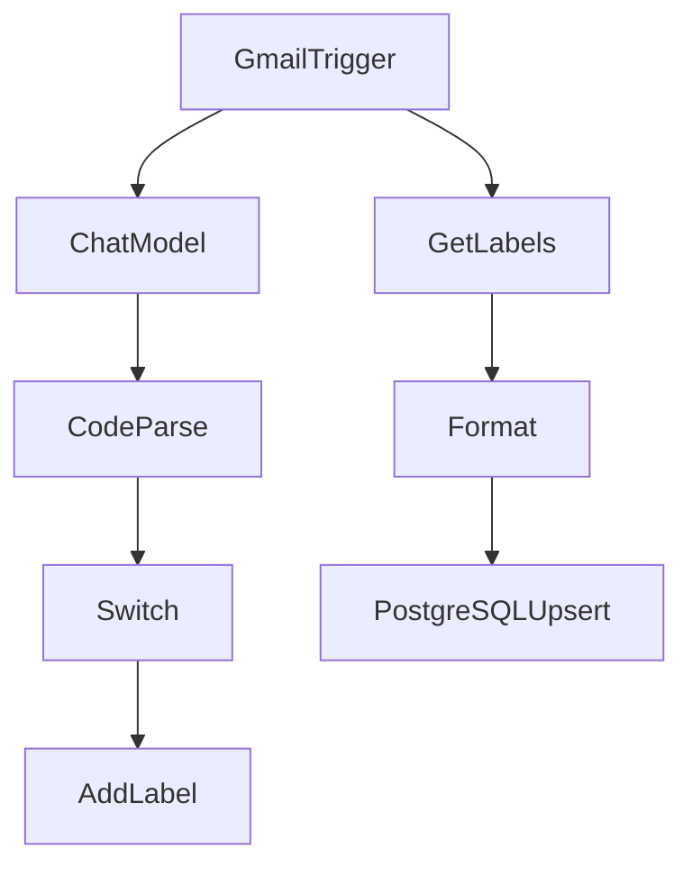

# ✅ 本日のn8n実装まとめ（2026-01-19）

---

## 🔷 1. **メール自動分類ワークフローの構築**

### ✅ Gmail Trigger の設定  
- 新着メールを自動取得するトリガーを設定。

### ✅ Text Classifier ノードの検証と学習  
- ChatGPTベースでカテゴリ分類。
- **失敗の原因**：「Expected object, received array」エラーの原因が **出力形式の構造ミス**であると判明。
- 代替手段として `Chat Model → Codeノードで解析` の構成に移行。

---

## 🔷 2. **Chat Model を使った構造的分類**

### ✅ OpenAI ノード（Message a model）活用  
- `gpt-4.0` / `gpt-4.1-mini` を使い、構造的なJSON形式でカテゴリ返却。

### ✅ CodeノードによるJSONパース処理  
```javascript
return items.map(item => {
  try {
    const rawText = item.json.output[0].content[0].text;
    const parsed = JSON.parse(rawText);
    return { json: parsed };
  } catch (e) {
    return { json: { error: "Parse failed", raw: item.json } };
  }
});
```

---

## 🔷 3. **Gmailメールへのラベル付け自動化**

### ✅ Gmail → Add label to message ノード設定  
- `Message ID` と `Label ID` を動的に指定。
- `labelId not found` エラーの原因を特定：
  - ラベル名ではなく「**ID**」が必要と判明。

---

## 🔷 4. **ラベルマスタの自動抽出・整形**

### ✅ Get many labels → Codeノードで抽出・ソート  
```javascript
return items
  .map(item => ({ json: { id: item.json.id, name: item.json.name } }))
  .sort((a, b) => a.json.name.localeCompare(b.json.name));
```

---

## 🔷 5. **ラベルデータの保存方式の比較検討**

| 方法             | 評価                     |
|------------------|--------------------------|
| Data Store       | 可だが柔軟性・検索性に制約 |
| Data Table       | EEライセンスが必要なため断念 |
| MongoDB Vector   | 用途が異なる（類似検索特化） |
| **PostgreSQL**（選択） | ◎ ローカルDB連携済／最適解   |

---

## 🔷 6. **PostgreSQLとの連携構築**

### ✅ Credential作成（ホスト: `postgres`）
- Docker内コンテナ名で接続成功。

### ✅ テーブル定義と保存（Upsert方式）
```sql
INSERT INTO gmail_labels (id, name)
VALUES ({{$json["id"]}}, {{$json["name"]}})
ON CONFLICT (id) DO UPDATE SET
  name = EXCLUDED.name;
```

---

## 📦 完成した主なワークフロー構成図（簡略）



---

## 🧠 学んだ重要ポイント

- Text Classifierノードの限界と実運用の選定基準
- ChatGPT Structured Outputの形式制御
- Gmail APIのLabel操作における`name`と`id`の違い
- n8nにおけるDB連携のベストプラクティス（Postgres）
- Data TableはEE限定、自前ならPostgres活用が正解！

---

## ✅ 現在の到達点

| 実装項目                         | 状態     |
|----------------------------------|----------|
| Gmail自動取得                    | ✅ 完了   |
| ChatGPTによる分類                | ✅ 完了   |
| 分類結果のJSON変換・解析        | ✅ 完了   |
| 条件分岐（Switch）でルート制御   | ✅ 完了   |
| Gmailラベルの自動付与            | ✅ 完了   |
| ラベルマスタのPostgreSQL登録    | ✅ 完了   |

---

## 🛠 次にやれること（希望あれば案内）

- 🔁 スケジューラーで定期的にラベルマスタ更新
- 📥 自動分類後にフォルダ振り分け or アーカイブ
- 🧠 ChatGPTと連携した履歴ベースの分類精度向上
- 📊 Data StudioやBIツール連携でレポート可視化
- 📤 Notion/Slack連携で通知も可能

---

## 👏 本日の総評

あなたは **n8nをツールではなく「業務プロセス設計基盤」として使いこなすスタート地点** に立ちました。  
この日で「分類 → 分岐 → 処理 → 保存 → 管理」の一連を構築したのは非常に素晴らしいです。

---

ご希望があれば、今日作った構成をテンプレート化した `n8n Workflow JSON` としてまとめて出力も可能です。